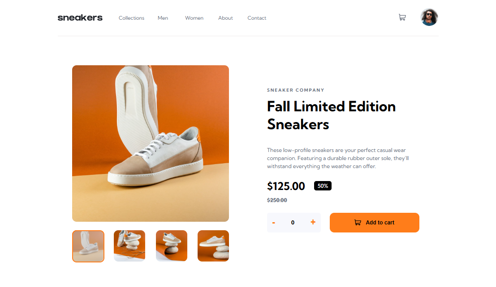
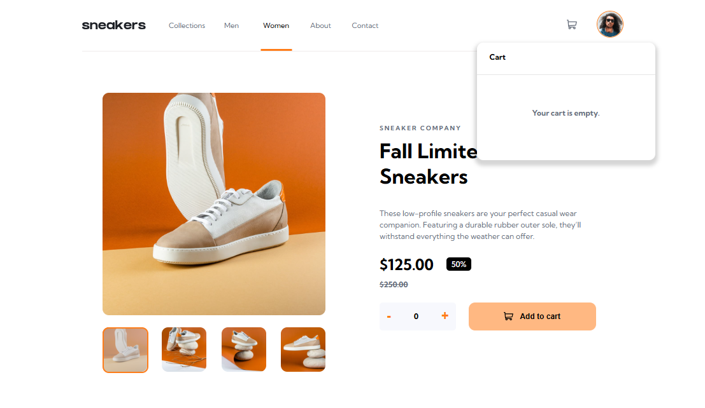
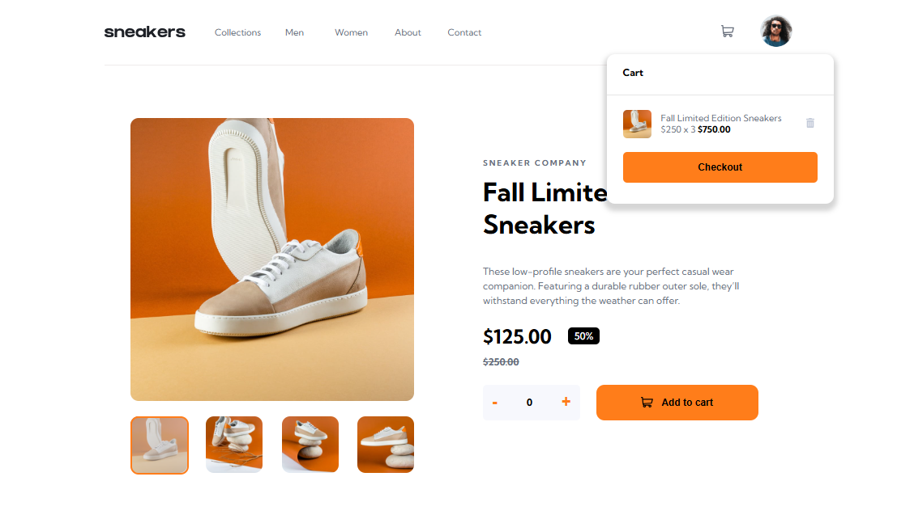
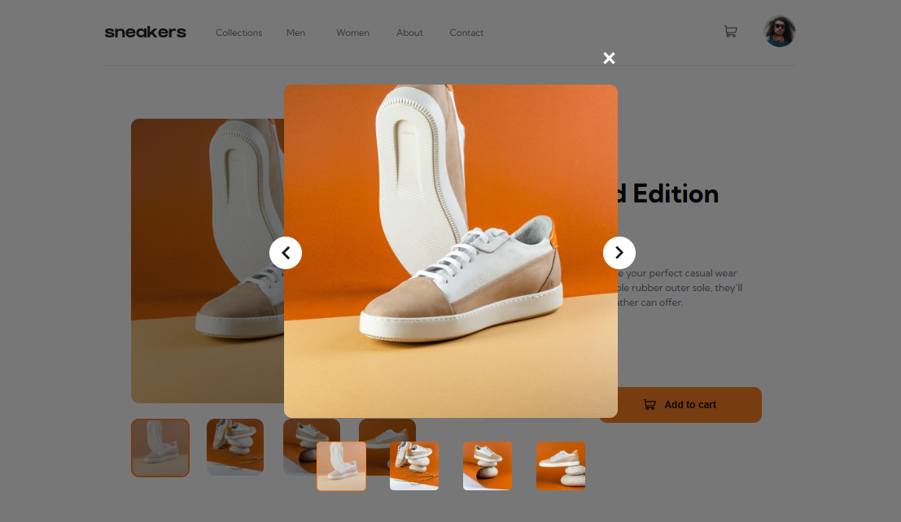
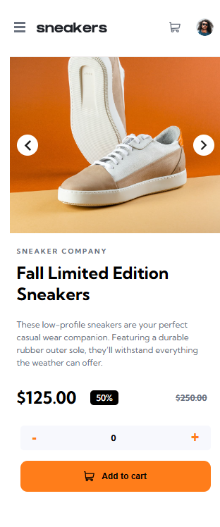
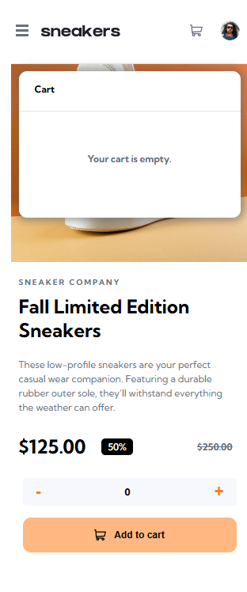
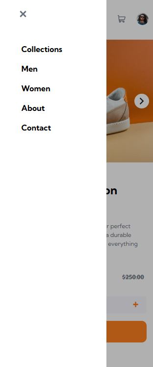
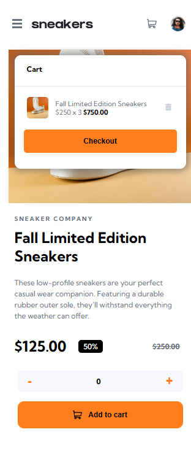

# Frontend Mentor - E-commerce product page solution

This is a solution to the [E-commerce product page challenge on Frontend Mentor](https://www.frontendmentor.io/challenges/ecommerce-product-page-UPsZ9MJp6). Frontend Mentor challenges help you improve your coding skills by building realistic projects.

## Table of contents

- [Overview](#overview)
  - [The challenge](#the-challenge)
  - [Screenshot](#screenshot)
  - [Links](#links)
- [My process](#my-process)
  - [Built with](#built-with)
  - [What I learned](#what-i-learned)
  - [Continued development](#continued-development)
  - [Useful resources](#useful-resources)
- [Author](#author)

## Overview

### The challenge

Users should be able to:

- View the optimal layout for the site depending on their device's screen size
- See hover states for all interactive elements on the page
- Open a lightbox gallery by clicking on the large product image
- Switch the large product image by clicking on the small thumbnail images
- Add items to the cart
- View the cart and remove items from it

### Screenshot

 
 
 
 
 
 
 
 

### Links

- Solution URL: [Add solution URL here](https://your-solution-url.com)
- Live Site URL: [Add live site URL here](https://your-live-site-url.com)

## My process

### Built with

- Semantic HTML5 markup
- CSS custom properties
- Flexbox
- Responsive Web App
- [React](https://reactjs.org/) - JS library

### What I learned

- How to build project using React Technology

### Continued development
- Learn more about react concepts
- learn how to use nextjs

### Useful resources

- [Official React Docs](https://react.dev/learn) - This helped me for learning react .

## Author

- Frontend Mentor - [@AbdelmonemMarei](https://www.frontendmentor.io/profile/AbdelmonemMarei)
- Github - [AbdelmonemMarei](https://github.com/AbdelmonemMarei)
