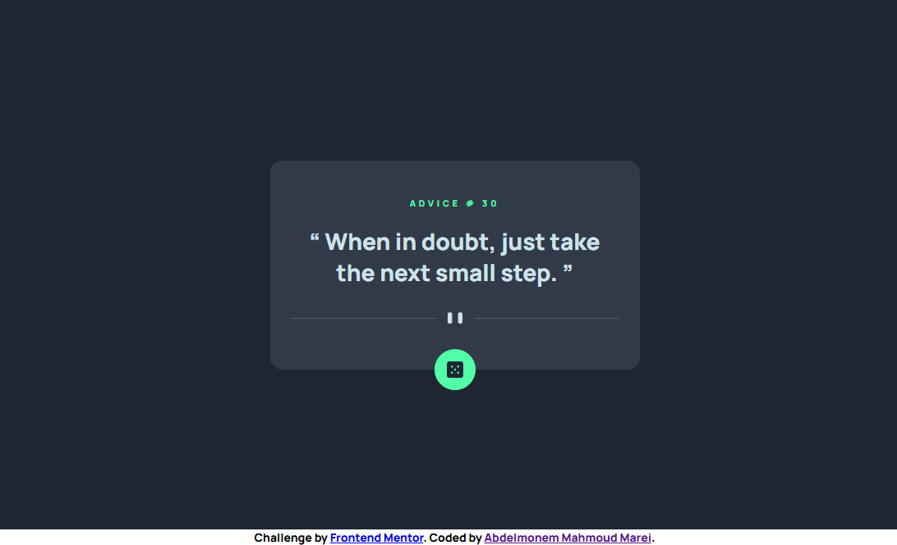
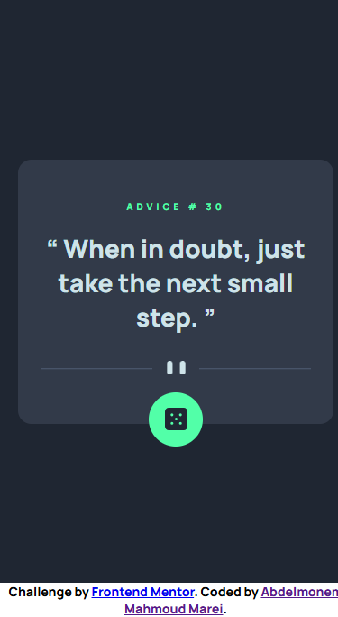

# Frontend Mentor - Advice generator app solution

This is a solution to the [Advice generator app challenge on Frontend Mentor](https://www.frontendmentor.io/challenges/advice-generator-app-QdUG-13db). Frontend Mentor challenges help you improve your coding skills by building realistic projects.


## Table of contents

- [Overview](#overview)
  - [The challenge](#the-challenge)
  - [Screenshot](#screenshot)
  - [Links](#links)
- [My process](#my-process)
  - [Built with](#built-with)
  - [What I learned](#what-i-learned)
- [Author](#author)

## Overview

### The challenge

Users should be able to:

- View the optimal layout for the app depending on their device's screen size
- See hover states for all interactive elements on the page
- Generate a new piece of advice by clicking the dice icon

### Screenshot

 
 

### Links

- Github URL: [Github Source Files](https://github.com/AbdelmonemMarei/Front-End-Mentor-Challenges/tree/main/Junior/advice-generator-app-main)
- Live Site URL: [Live Site URL](https://abdelmonemmarei.github.io/Front-End-Mentor-Challenges/Junior/advice-generator-app-main/)

## My process

### Built with

- Semantic HTML5 markup
- CSS custom properties
- Flexbox
- Responsive Web App
- Pure JS
- Fetch API

### What I learned

- Add animation spinner while fetching data 
```css
/* load spinner */
.container .icon.fetching{
    -webkit-animation:spin 2s linear infinite;
    -moz-animation:spin 2s linear infinite;
    animation:spin 2s linear infinite;

}
@-moz-keyframes spin { 
    100% { -moz-transform: rotate(360deg); } 
}
@-webkit-keyframes spin { 
    100% { -webkit-transform: rotate(360deg); } 
}
@keyframes spin { 
    100% { 
        -webkit-transform: rotate(360deg); 
        transform:rotate(360deg); 
    } 
}
```

- Use Fetch API to fetch advices data and async Function to deal with Promise return from fetch api
```js
async function fetchingAdvice(){
    // load spinner
    icon.classList.add('fetching');
    
    fetch("https://api.adviceslip.com/advice")
    .then(data => data.json())
    .then(advice => {
        idDiv.textContent = `advice # ${advice.slip.id}`
        adviceDiv.textContent = ` ${advice.slip.advice} `
        icon.classList.remove('fetching');
    }).catch(error=> Error(error));
}

```


## Author

- Frontend Mentor - [@AbdelmonemMarei](https://www.frontendmentor.io/profile/AbdelmonemMarei)
- Github - [AbdelmonemMarei](https://github.com/AbdelmonemMarei)
