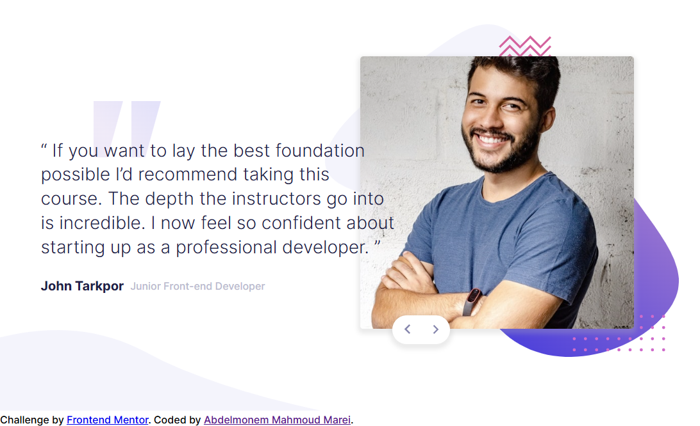
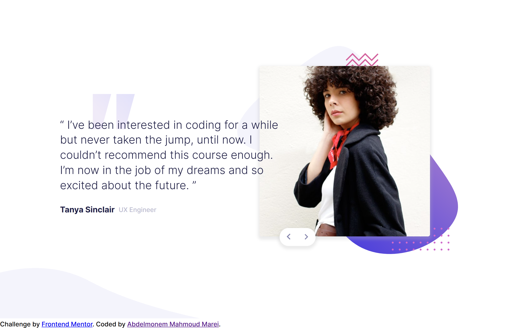
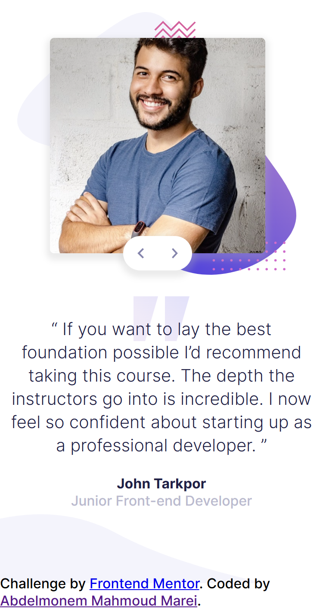
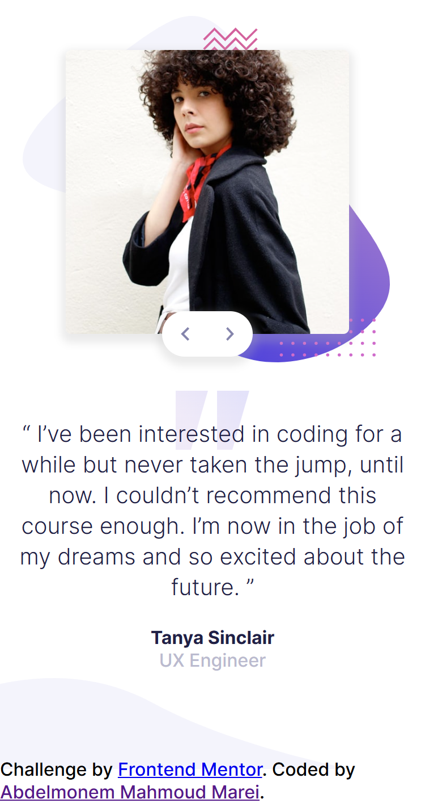

# Frontend Mentor - Coding bootcamp testimonials slider solution

This is a solution to the [Coding bootcamp testimonials slider challenge on Frontend Mentor](https://www.frontendmentor.io/challenges/coding-bootcamp-testimonials-slider-4FNyLA8JL). Frontend Mentor challenges help you improve your coding skills by building realistic projects. 


## Table of contents

- [Overview](#overview)
  - [The challenge](#the-challenge)
  - [Screenshot](#screenshot)
  - [Links](#links)
- [My process](#my-process)
  - [Built with](#built-with)
  - [What I learned](#what-i-learned)
- [Author](#author)


## Overview

### The challenge

Users should be able to:

- View the optimal layout for the component depending on their device's screen size
- Navigate the slider using either their mouse/trackpad or keyboard

### Screenshot

 
 
 
 


### Links

- Github URL: [Github Source Files](https://github.com/AbdelmonemMarei/Front-End-Mentor-Challenges/tree/main/Junior/coding-bootcamp-testimonials-slider-master)
- Live Site URL: [Live Site URL](https://abdelmonemmarei.github.io/Front-End-Mentor-Challenges/Junior/coding-bootcamp-testimonials-slider-master/)

## My process

### Built with

- Semantic HTML5 markup
- CSS custom properties
- Flexbox
- Responsive Web Application
- Pure JS 

### What I learned

Use Background Properites to custom background images
```css
.container .card-container>div .description .content{
  //...
    background-image: url(../images/pattern-quotes.svg);
    background-repeat: no-repeat;
    background-size: 105px;
    background-position: 82px 11px;
  //...
}
```
use javascript to toggle between two cards
```js
sliderArrows.forEach(el => {
    el.addEventListener("click",() => {
        forwardCard.classList.toggle("hidden");
        bacwardCard.classList.toggle("hidden");
    })
})
```


## Author

- Frontend Mentor - [@AbdelmonemMarei](https://www.frontendmentor.io/profile/AbdelmonemMarei)
- Github - [AbdelmonemMarei](https://github.com/AbdelmonemMarei)

