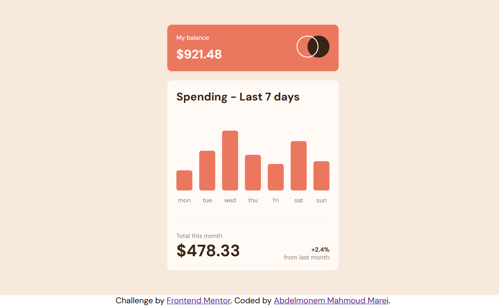
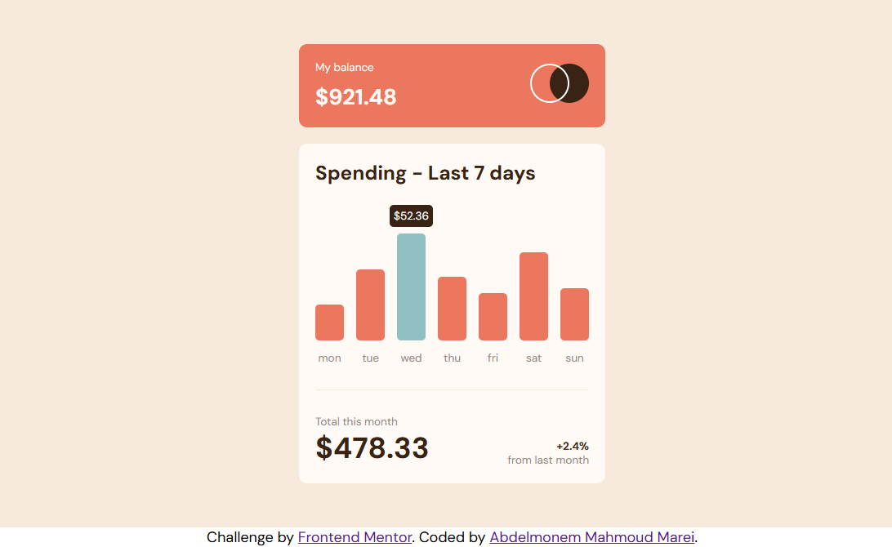
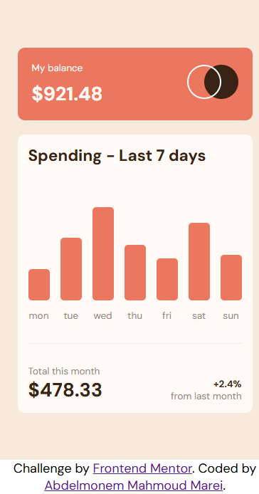
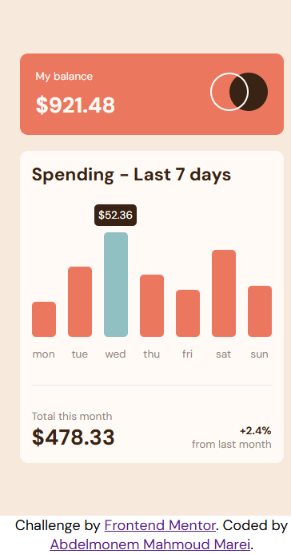

# Frontend Mentor - Expenses chart component solution

This is a solution to the [Expenses chart component challenge on Frontend Mentor](https://www.frontendmentor.io/challenges/expenses-chart-component-e7yJBUdjwt). Frontend Mentor challenges help you improve your coding skills by building realistic projects. 


## Table of contents

- [Overview](#overview)
  - [The challenge](#the-challenge)
  - [Screenshot](#screenshot)
  - [Links](#links)
- [My process](#my-process)
  - [Built with](#built-with)
  - [What I learned](#what-i-learned)
  - [Useful resources](#useful-resources)
- [Author](#author)

## Overview

### The challenge

Users should be able to:

- View the bar chart and hover over the individual bars to see the correct amounts for each day
- See the current day’s bar highlighted in a different colour to the other bars
- View the optimal layout for the content depending on their device’s screen size
- See hover states for all interactive elements on the page
- **Bonus**: Use the JSON data file provided to dynamically size the bars on the chart

### Screenshot
 
 
 
 

### Links

- Github URL: [Github Source Files](https://github.com/AbdelmonemMarei/Front-End-Mentor-Challenges/tree/main/Junior/expenses-chart-component-main)
- Live Site URL: [Live Site URL](https://abdelmonemmarei.github.io/Front-End-Mentor-Challenges/Junior/expenses-chart-component-main/)


## My process

### Built with

- Semantic HTML5 markup
- CSS custom properties
- Flexbox
- Responsive Web App
- Pure JS
- Fetch API

### What I learned

- use css pesudo elements , attr and data-attribute added by JS to HTML element to dynamically add price 
```css
.container .card-container .spending-card .ratings >div:hover::after{
    content: "$"attr(data-amount);
    position: absolute;
    top: -35px;
    color: white;
    background-color: var(--Dark-brown);
    width: fit-content;
    padding: 5px;
    font-size: 0.75rem;
    border-radius: 5px;
    -webkit-border-radius: 5px;
    -moz-border-radius: 5px;
    -ms-border-radius: 5px;
    -o-border-radius: 5px;
}
```
- Use Fetch API to fetch data from JSON file and use JS to dynamically add height and data-amount to HTML element
```js
const fetchingData = fetch("./data.json");

fetchingData.then(result =>{
    return result.json();
}).then(data=>{
    for(const property in data){
        let dayDiv = document.querySelector(`.${data[property]["day"]}`);
        dayDiv.setAttribute("data-amount",`${data[property]["amount"]}`)
        dayDiv.style.height = `${data[property]["amount"]}` / 100 * 250 +"px";
    }
}).catch(err => console.log(Error(err)))

```

### Useful resources

- [MDN Fetch API](https://developer.mozilla.org/en-US/docs/Web/API/Fetch_API) - To Learn how to use fetch API.
- [MDN data-attributes](https://developer.mozilla.org/en-US/docs/Learn/HTML/Howto/Use_data_attributes) - To Learn how to use data-attributes.

## Author

- Frontend Mentor - [@AbdelmonemMarei](https://www.frontendmentor.io/profile/AbdelmonemMarei)
- Github - [AbdelmonemMarei](https://github.com/AbdelmonemMarei)


