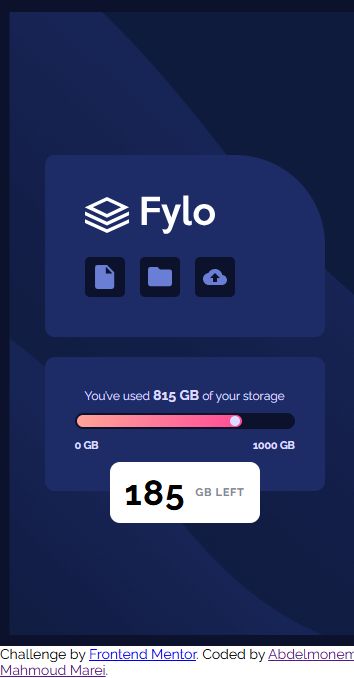

# Frontend Mentor - Fylo data storage component solution

This is a solution to the [Fylo data storage component challenge on Frontend Mentor](https://www.frontendmentor.io/challenges/fylo-data-storage-component-1dZPRbV5n). Frontend Mentor challenges help you improve your coding skills by building realistic projects. 


## Table of contents

- [Overview](#overview)
  - [The challenge](#the-challenge)
  - [Screenshot](#screenshot)
  - [Links](#links)
- [My process](#my-process)
  - [Built with](#built-with)
  - [What I learned](#what-i-learned)
- [Author](#author)


## Overview

### The challenge

Users should be able to:

- View the optimal layout for the site depending on their device's screen size

### Screenshot
 
 

### Links

- Github URL: [Github Source Files](https://github.com/AbdelmonemMarei/Front-End-Mentor-Challenges/tree/main/Junior/fylo-data-storage-component-master)
- Live Site URL: [Live Site URL](https://abdelmonemmarei.github.io/Front-End-Mentor-Challenges/Newbie/four-card-feature-section-master/)

## My process

### Built with

- Semantic HTML5 markup
- CSS custom properties
- Flexbox
- CSS Pesudo Elements
- Responsive Web App


### What I learned

Use Pesudo elements to add elements via css and use background-image to customize background according to device size
```css
.container .cards-container .storage-card .storage-bar::after{
    content: "";
    position: absolute;
    width: 10px;
    height: 10px;
    border-radius: 50%;
    -webkit-border-radius: 50%;
    -moz-border-radius: 50%;
    -ms-border-radius: 50%;
    -o-border-radius: 50%;
    top: 3px;
    left: calc(75% - 10px);
    background-color: var(--Pale-Blue);
}

.container::before{
  background-image: url(../images/bg-mobile.png);
  background-size: 350px auto;
  background-position: center;
  width: 100%;
  height: 100%;
  top: 0;
  left: 50%;
  transform: translateX(-50%);
  -webkit-transform: translateX(-50%);
  -moz-transform: translateX(-50%);
  -ms-transform: translateX(-50%);
  -o-transform: translateX(-50%);
}
```
## Author

- Frontend Mentor - [@AbdelmonemMarei](https://www.frontendmentor.io/profile/AbdelmonemMarei)
- Github - [AbdelmonemMarei](https://github.com/AbdelmonemMarei)
