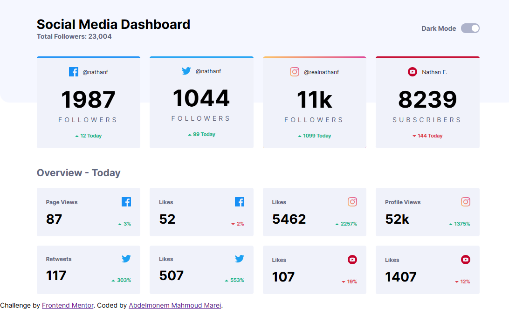
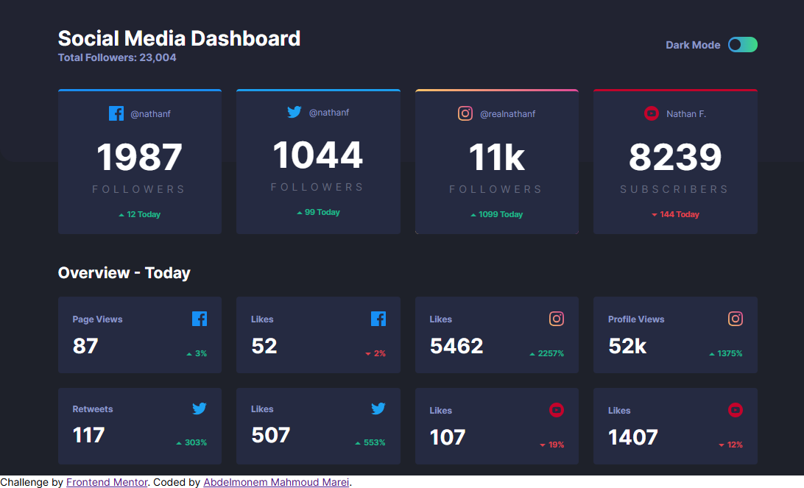
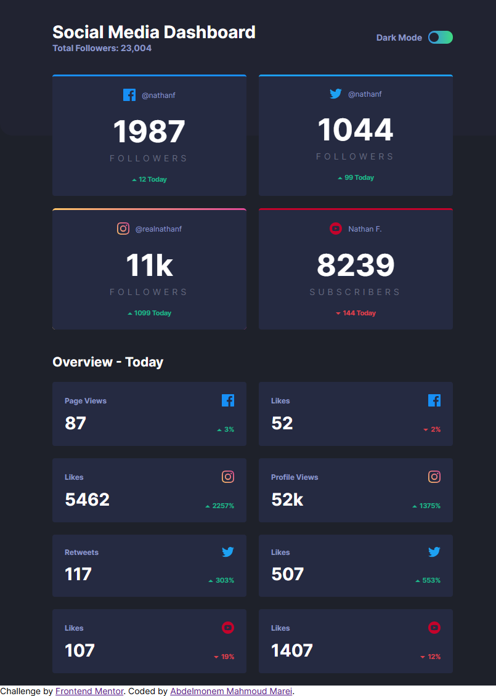
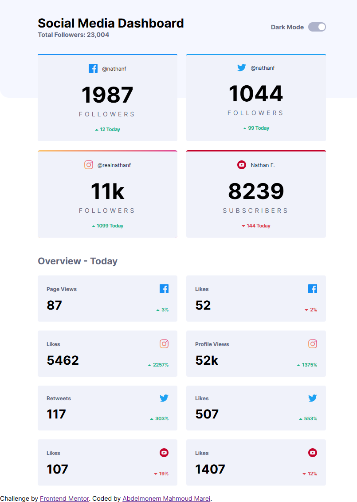
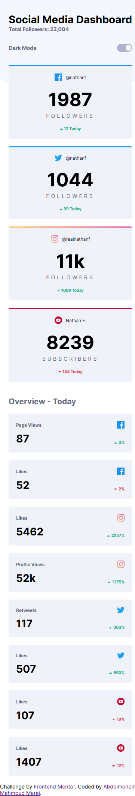
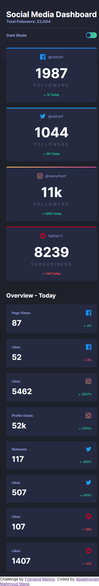

# Frontend Mentor - Social media dashboard with theme switcher solution

This is a solution to the [Social media dashboard with theme switcher challenge on Frontend Mentor](https://www.frontendmentor.io/challenges/social-media-dashboard-with-theme-switcher-6oY8ozp_H). Frontend Mentor challenges help you improve your coding skills by building realistic projects. 


## Table of contents

- [Overview](#overview)
  - [The challenge](#the-challenge)
  - [Screenshot](#screenshot)
  - [Links](#links)
- [My process](#my-process)
  - [Built with](#built-with)
  - [What I learned](#what-i-learned)
- [Author](#author)


## Overview

### The challenge

Users should be able to:

- View the optimal layout for the site depending on their device's screen size
- See hover states for all interactive elements on the page
- Toggle color theme to their preference

### Screenshot

 
 
 
 
 
 

### Links

- Github URL: [Github Source Files](https://github.com/AbdelmonemMarei/Front-End-Mentor-Challenges/tree/main/Junior/social-media-dashboard-with-theme-switcher-master)
- Live Site URL: [Live Site URL](https://abdelmonemmarei.github.io/Front-End-Mentor-Challenges/Junior/social-media-dashboard-with-theme-switcher-master/)

## My process

### Built with

- Semantic HTML5 markup
- CSS custom properties
- Flexbox
- CSS Grid
- Responsive Web Application
- Pure JS


### What I learned

- Use css Grid  and grid-template-columns to display cards responsively

- Add gradient border 

```css
.container .dashboard-container .overview .overview-grid{
    display: grid;
    grid-template-columns: repeat(auto-fit, minmax(210px, 1fr));
    gap: 20px;
}

.container .dashboard-container .overall-grid .instagram-overall::before{
    content: "";
    position: absolute;
    top: -3px;
    left: 0;
    right: 0;
    bottom: 0;
    border-radius: 5px;
    border-top: 3px solid transparent;
    background: var(--Primary-Instagram) border-box;
    -webkit-mask:linear-gradient(#fff 0 0) padding-box,linear-gradient(#fff 0 0);
    -webkit-mask-composite: destination-out;
    mask-composite: exclude;
    -webkit-border-radius: 5px;
    -moz-border-radius: 5px;
    -ms-border-radius: 5px;
    -o-border-radius: 5px;
}

```

## Author

- Frontend Mentor - [@AbdelmonemMarei](https://www.frontendmentor.io/profile/AbdelmonemMarei)
- Github - [AbdelmonemMarei](https://github.com/AbdelmonemMarei)
