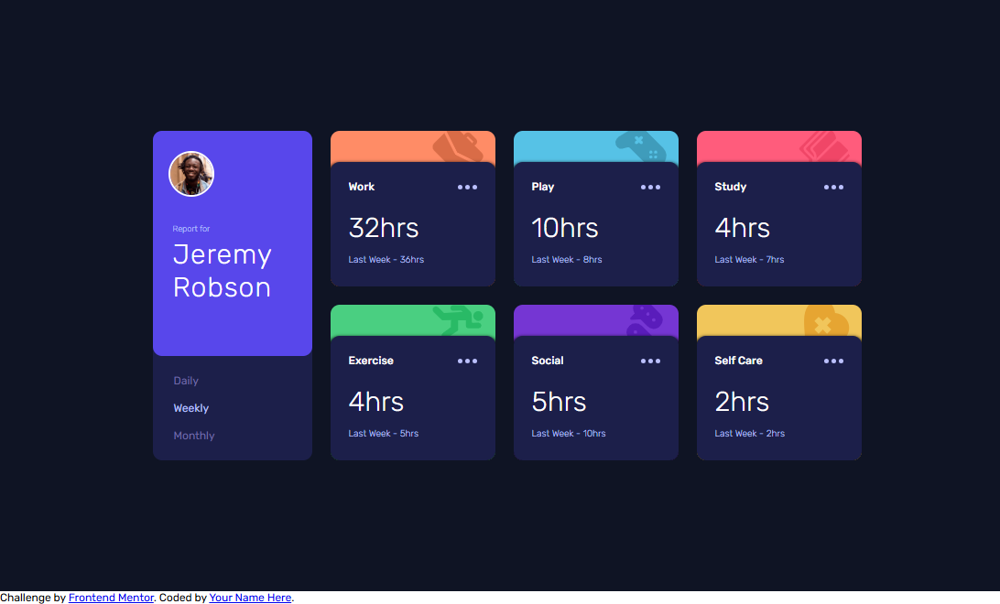
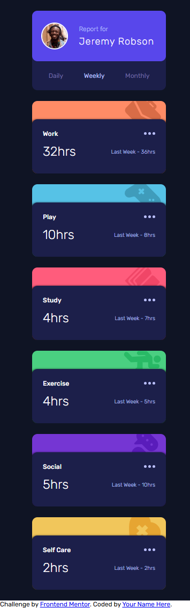

# Frontend Mentor - Time tracking dashboard solution

This is a solution to the [Time tracking dashboard challenge on Frontend Mentor](https://www.frontendmentor.io/challenges/time-tracking-dashboard-UIQ7167Jw). Frontend Mentor challenges help you improve your coding skills by building realistic projects. 


## Table of contents

- [Overview](#overview)
  - [The challenge](#the-challenge)
  - [Screenshot](#screenshot)
  - [Links](#links)
- [My process](#my-process)
  - [Built with](#built-with)
  - [What I learned](#what-i-learned)
  - [Continued development](#continued-development)
  - [Useful resources](#useful-resources)
- [Author](#author)
- [Acknowledgments](#acknowledgments)


## Overview

### The challenge

Users should be able to:

- View the optimal layout for the site depending on their device's screen size
- See hover states for all interactive elements on the page
- Switch between viewing Daily, Weekly, and Monthly stats

### Screenshot

 
 

### Links

- Github URL: [Github Source Files](https://github.com/AbdelmonemMarei/Front-End-Mentor-Challenges/tree/main/Junior/time-tracking-dashboard-main)
- Live Site URL: [Live Site URL](https://abdelmonemmarei.github.io/Front-End-Mentor-Challenges/Junior/time-tracking-dashboard-main/)

## My process

### Built with

- Semantic HTML5 markup
- CSS custom properties
- Flexbox
- CSS Grid
- Responsive Web Application
- Pure Javascript

### What I learned

- Use Grid template columns to make cards responsive and use backgroud properties to adjust icons 

```css
.card-container .stats{
    display: grid;
    grid-template-columns:   repeat(3, minmax(180px, 1fr));
    gap: 20px;
    align-items: center;
}


.card-container .stats .social{
    background-color: var(--Violet-social);
    background-image: url(../images/icon-social.svg);
    background-size: 54px auto;
    background-position: 90% -10px;
}
```
- Use fetch api to get data from json file
```js
fetch("data.json")
.then(data => data.json())
.then(data => {
        //....
    })
```

## Author

- Frontend Mentor - [@AbdelmonemMarei](https://www.frontendmentor.io/profile/AbdelmonemMarei)
- Github - [AbdelmonemMarei](https://github.com/AbdelmonemMarei)

