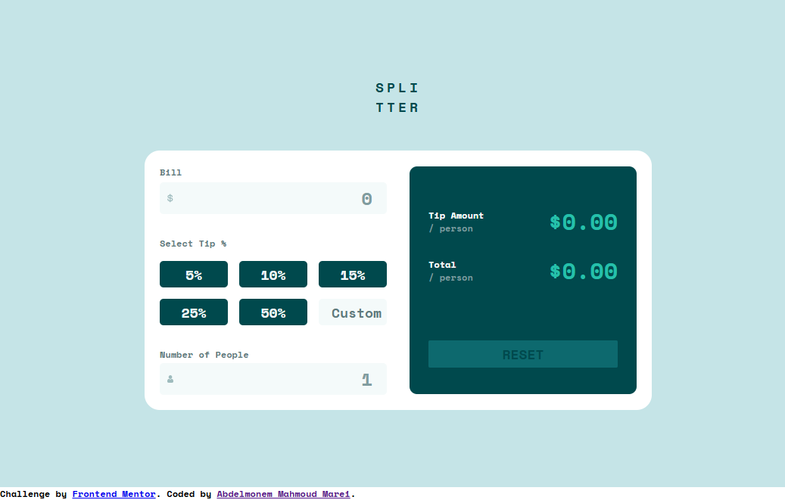
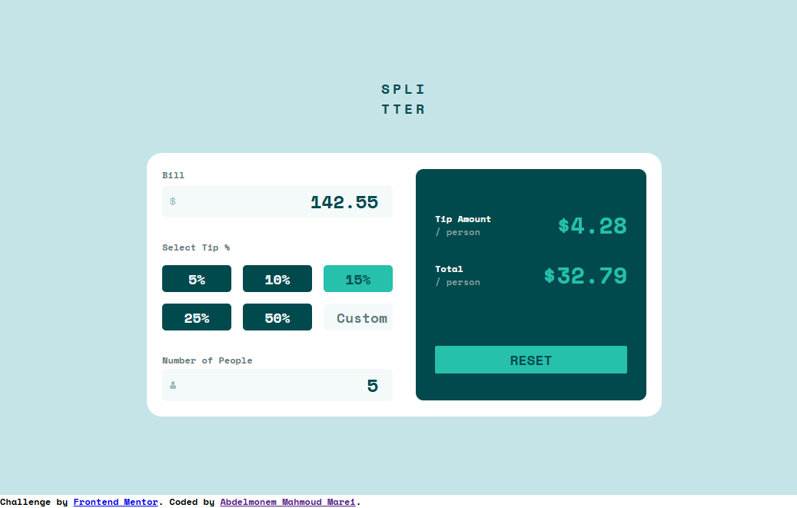
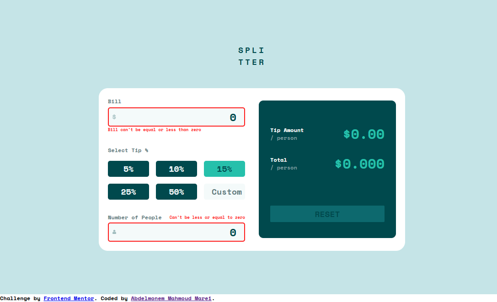
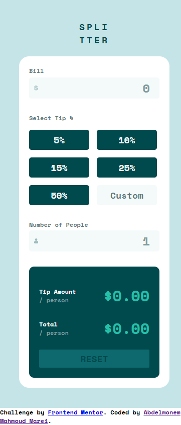
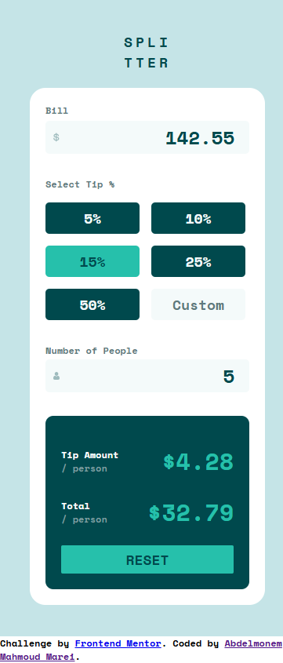

# Frontend Mentor - Tip calculator app solution

This is a solution to the [Tip calculator app challenge on Frontend Mentor](https://www.frontendmentor.io/challenges/tip-calculator-app-ugJNGbJUX). Frontend Mentor challenges help you improve your coding skills by building realistic projects.


## Table of contents

- [Overview](#overview)
  - [The challenge](#the-challenge)
  - [Screenshot](#screenshot)
  - [Links](#links)
- [My process](#my-process)
  - [Built with](#built-with)
  - [What I learned](#what-i-learned)
- [Author](#author)


## Overview

### The challenge

Users should be able to:

- View the optimal layout for the app depending on their device's screen size
- See hover states for all interactive elements on the page
- Calculate the correct tip and total cost of the bill per person

### Screenshot

 
 
 
 
 
 

### Links

- Github URL: [Github Source Files](https://github.com/AbdelmonemMarei/Front-End-Mentor-Challenges/tree/main/Junior/tip-calculator-app-main)
- Live Site URL: [Live Site URL](https://abdelmonemmarei.github.io/Front-End-Mentor-Challenges/Junior/tip-calculator-app-main/)

## My process

### Built with

- Semantic HTML5 markup
- CSS custom properties
- Flexbox
- CSS Grid
- Responsive Web Application
- Pure Javascript


### What I learned

Use Javascript to Calculate Tip and update UI
```js

function ResetTips ( bill_value, tip_value, custom_tip_value, number_of_people ){
    let tipAmountValue =  custom_tip_value?(bill_value * ((custom_tip_value / (100 * number_of_people)))):((bill_value * (tip_value/ (100 * number_of_people))))
    let totalAmountValue =  ((bill_value / number_of_people) + tipAmountValue)

    tipAmount.textContent = `$${tipAmountValue.toPrecision(3)}`
    totalAmount.textContent = `$${totalAmountValue.toPrecision(4)}`

    resetBtn.classList.add('active');
}

//...
```

## Author

- Frontend Mentor - [@AbdelmonemMarei](https://www.frontendmentor.io/profile/AbdelmonemMarei)
- Github - [AbdelmonemMarei](https://github.com/AbdelmonemMarei)
