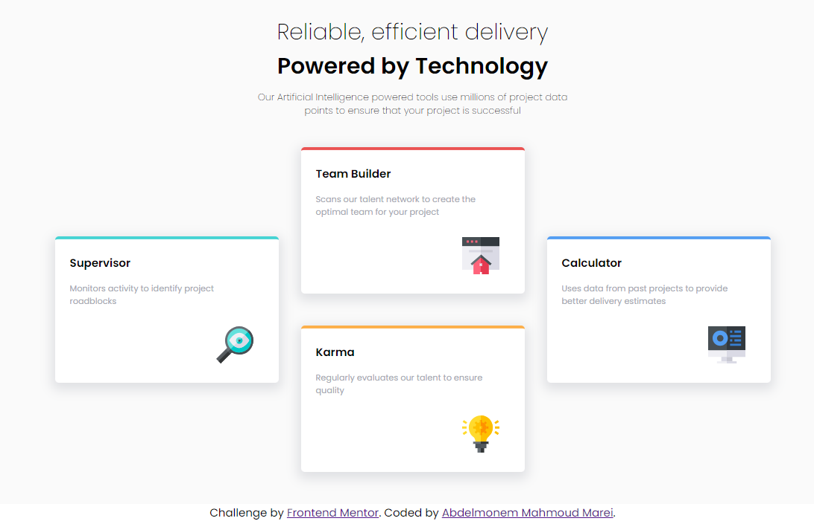
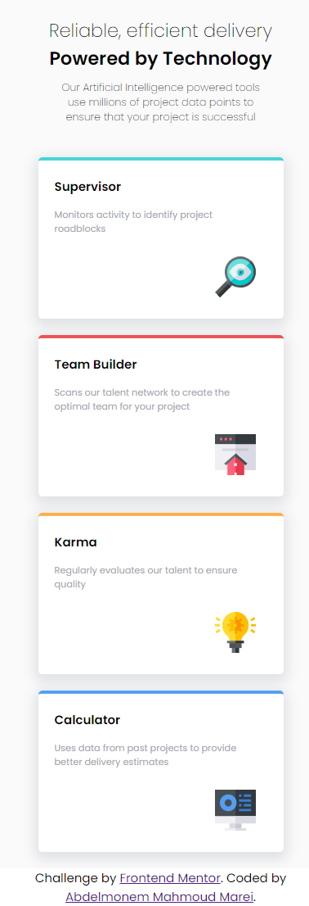

# Frontend Mentor - Four card feature section solution

This is a solution to the [Four card feature section challenge on Frontend Mentor](https://www.frontendmentor.io/challenges/four-card-feature-section-weK1eFYK). Frontend Mentor challenges help you improve your coding skills by building realistic projects. 

## Table of contents

- [Overview](#overview)
  - [The challenge](#the-challenge)
  - [Screenshot](#screenshot)
  - [Links](#links)
- [My process](#my-process)
  - [Built with](#built-with)
  - [What I learned](#what-i-learned)
  - [Useful resources](#useful-resources)
- [Author](#author)
- [Acknowledgments](#acknowledgments)

**Note: Delete this note and update the table of contents based on what sections you keep.**

## Overview

### The challenge

Users should be able to:

- View the optimal layout for the site depending on their device's screen size

### Screenshot

 
 

### Links

- Solution URL: [Add solution URL here](https://your-solution-url.com)
- Live Site URL: [Add live site URL here](https://your-live-site-url.com)

## My process

### Built with

- Semantic HTML5 markup
- CSS custom properties
- Flexbox
- CSS Grid
- Responsive Web Design

### What I learned

Using Custom Grid to fit your website requirements (grid-area)
```css
.container .cards{
    display: grid;
    grid-template-columns: repeat(6,150px);
    grid-template-rows: repeat(4,100px);
}
.container .cards .sup-card{
    grid-area: 2/1/4/3;
}
```
To make site responsive
```css
@media(width){

}
```


### Continued development

I need to Learn More about Grid Methods to custom responsive site layout


### Useful resources

- [Grid Area](https://developer.mozilla.org/en-US/docs/Web/CSS/grid-area) - This helped me for learning how to use Grid area to custom four cards layout.


## Author

- Frontend Mentor - [@AbdelmonemMarei](https://www.frontendmentor.io/profile/AbdelmonemMarei)
- Github - [AbdelmonemMarei](https://github.com/AbdelmonemMarei)

