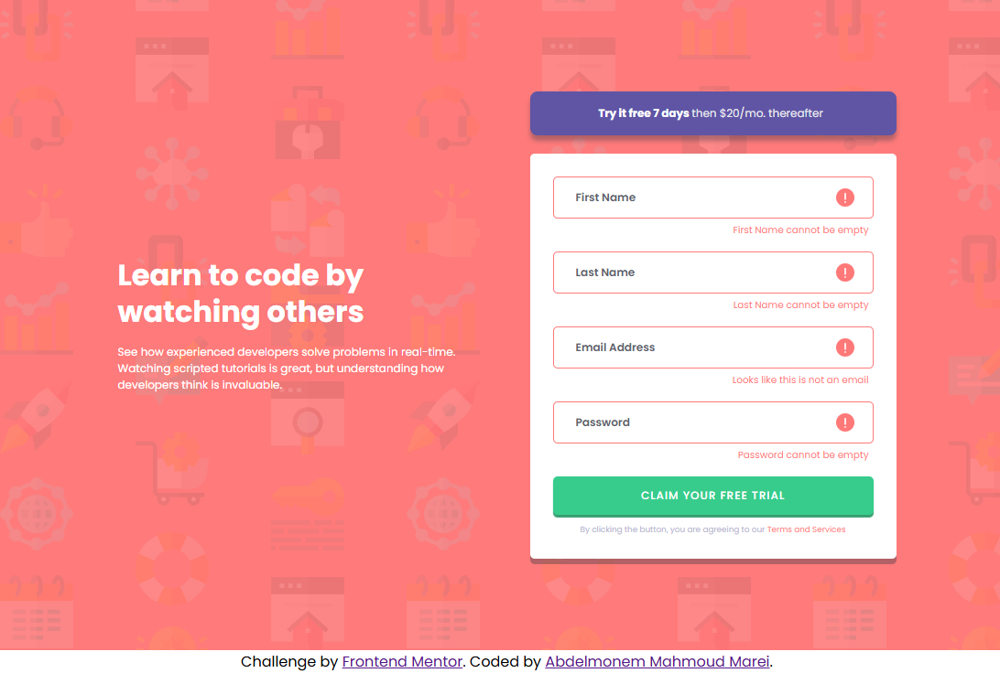

# Frontend Mentor - Intro component with sign up form solution

This is a solution to the [Intro component with sign up form challenge on Frontend Mentor](https://www.frontendmentor.io/challenges/intro-component-with-signup-form-5cf91bd49edda32581d28fd1). Frontend Mentor challenges help you improve your coding skills by building realistic projects. 


## Table of contents

- [Overview](#overview)
  - [The challenge](#the-challenge)
  - [Screenshot](#screenshot)
  - [Links](#links)
- [My process](#my-process)
  - [Built with](#built-with)
  - [What I learned](#what-i-learned)
  - [Useful resources](#useful-resources)
- [Author](#author)


## Overview

### The challenge

Users should be able to:

- View the optimal layout for the site depending on their device's screen size
- See hover states for all interactive elements on the page
- Receive an error message when the `form` is submitted if:
  - Any `input` field is empty. The message for this error should say *"[Field Name] cannot be empty"*
  - The email address is not formatted correctly (i.e. a correct email address should have this structure: `name@host.tld`). The message for this error should say *"Looks like this is not an email"*

### Screenshot
 
 
 
 

### Links
- Github URL: [Github Source Files](https://github.com/AbdelmonemMarei/Front-End-Mentor-Challenges/tree/main/Newbie/intro-component-with-signup-form-master)
- Live Site URL: [Live Site URL](https://abdelmonemmarei.github.io/Front-End-Mentor-Challenges/Newbie/intro-component-with-signup-form-master/)

## My process

### Built with

- Semantic HTML5 markup
- CSS custom properties
- Flexbox
- Responsive Web Application
- Pure JS

### What I learned

use Background Properties to add error SVG icon and use css selector  
```css
.container .user-form .inputs p.error.active{
    display: block;
}

.container .user-form .inputs p:last-child{
    color: var(--Grayish-Blue);
    font-size: 0.55rem;
    text-align: center;
    margin: 10px auto 0;
}
```
Use Javascript events and regex to validate form inputs 
```js
mail.addEventListener('blur',()=>{
    if((/^\w+@[a-zA-Z_]+?\.[a-zA-Z]{2,3}$/.test(mail.value)) ){
        mail.classList.remove('error')
        mail.nextElementSibling.classList.remove('active')
    }else{
        mail.classList.add('error')
        mail.nextElementSibling.classList.add('active')
    }
})
```


### Useful resources

- [MDN css selectors](https://developer.mozilla.org/en-US/docs/Web/CSS/CSS_Selectors) - This link to know more about css selectors
- [W3 School JS Events](https://www.w3schools.com/js/js_events.asp) - This link to know more about JS Events .

## Author

- Frontend Mentor - [@AbdelmonemMarei](https://www.frontendmentor.io/profile/AbdelmonemMarei)
- Github - [AbdelmonemMarei](https://github.com/AbdelmonemMarei)
