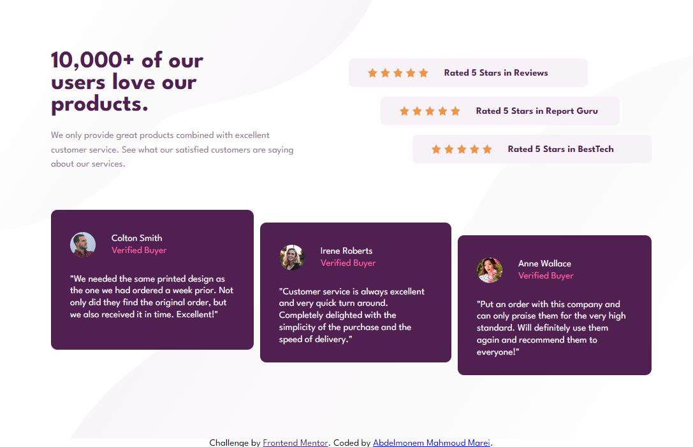
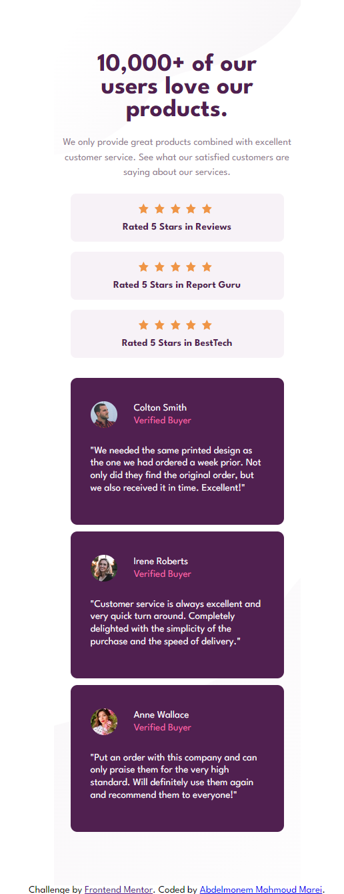

# Frontend Mentor - Social proof section


## Welcome! 👋


# Frontend Mentor - Social proof section solution

This is a solution to the [Social proof section challenge on Frontend Mentor](https://www.frontendmentor.io/challenges/social-proof-section-6e0qTv_bA). Frontend Mentor challenges help you improve your coding skills by building realistic projects. 

## Table of contents

- [Overview](#overview)
  - [The challenge](#the-challenge)
  - [Screenshot](#screenshot)
  - [Links](#links)
- [My process](#my-process)
  - [Built with](#built-with)
  - [What I learned](#what-i-learned)
  - [Useful resources](#useful-resources)
- [Author](#author)

## Overview

### The challenge

Users should be able to:

- View the optimal layout for the section depending on their device's screen size

### Screenshot

 
 


### Links

- Solution URL: [Add solution URL here](https://your-solution-url.com)
- Live Site URL: [Live Site URL](https://abdelmonemmarei.github.io/Front-End-Mentor-Challenges/Newbie/social-proof-section-master)

## My process

### Built with

- Semantic HTML5 markup
- CSS custom properties
- Flexbox
- Responsive Web Design

### What I learned

Use lazy loading when site has alot of images increase site perfoemance

```html
  
```
To add Custom Variables in CSS
```css
:root{

}
```
To make site responsive
```css
@media(width){

}
```

### Useful resources

- [Responsive Design](https://www.smashingmagazine.com/2011/01/guidelines-for-responsive-web-design/) - Some Suggestions to make site responsive
- [Custom Variables](https://developer.mozilla.org/en-US/docs/Web/CSS/Using_CSS_custom_properties) - To Use Custom Variables.


## Author

- Frontend Mentor - [@AbdelmonemMarei](https://www.frontendmentor.io/profile/AbdelmonemMarei)
- Github - [AbdelmonemMarei](https://github.com/AbdelmonemMarei)